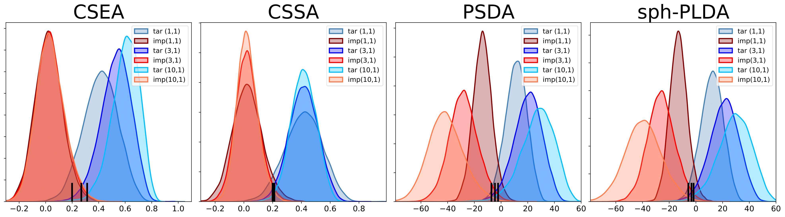

# Probabilistic backend for speaker recognition and clustering

## Spherical PLDA

This is a Pytorch implementation of a simple probabilistic scoring backend suitable for speaker recognition or clustering.

*Spherical* PLDA (sph-PLDA) is a special case of probabilistic linear discrimnant analysys (PLDA) applied to length-normalized embeddings.
Unlike the general model, sph-PLDA is parameterized by only two scalars that can be easily learned from data.

This model is presented as a possible replacement for cosine similarity, a popular scoring backend for large-margin embeddings. 
It can be shown that for length-normalized and centered embeddings, the verification log likelihood ratio of the sph-PLDA can be written 
as a scaled and shifted cosine similarity measure. That is, sph-PLDA is *equivalent* to cosine scoring for one-to-one comparisons.
However, as revealed in our experiments, sph-PLDA outperforms cosine scoring in multi-enrollment verification.

Another closely related scoring backend is the so-called probabilistic spherical discriminant analysis (PSDA) proposed [here](https://arxiv.org/abs/2203.14893).
It can be viewed as a PLDA model with Gaussian distributions replaced by von Mises-Fisher (VMF) distributions that are defined on the unit hypersphere.
The relation to spherical PLDA follows from the fact that restricting any isotropic Gaussian density to the unit hypersphere gives a VMF density, up to normalization. 
However, the two models are *not* equivalent, though their behavior is very similar, thus, sph-PLDA can serve as a more numerically stable alternative.

More details in: A. Sholokhov, N. Kuzmin, K. A. Lee, E. S. Chng, [Probabilistic Back-ends for Online Speaker Recognition and Clustering](https://arxiv.org/abs/2302.09523).


## Multi-enrollment verification

Distributions of target and impostor scores for different numbers of enrollment segments: 1, 3 and 10. Here and below, the notation (#enrollments, #tests) represents the number of enrollment or test segments in a single trial. Short black vertical lines represent EER thresholds.

Four different scoring backends are compared:
* CSEA - cosine similarity w/ embeddings averaging
* CSSA - cosine similarity w/ scores averaging
* sph-PLDA - spherical PLDA, by-the-book scoring
* PSDA - probabilistic spherical discriminant analysis, by-the-book scoring

<p align="center">
   
</p>

Results for multi-enrollment speaker verification with the embeddings extractor from the [SpeechBrain](https://huggingface.co/speechbrain/spkrec-ecapa-voxceleb).
Equal error rates (EER, %) with minDCF ($P_\text{target}=0.01$) in the last column (lower is better). 

|  Scoring | (1, 1) | (3, 1) | (10, 1) | (3, 3) |    pooled    |
|:--------:|:------:|:------:|:-------:|:------:|:------------:|
| CSEA     |  4.98  |  1.65  |   0.83  |  0.17  | 2.85 / 0.206 |
| CSSA     |  4.98  |  1.79  |   1.02  |  0.37  | 2.05 / 0.228 |
| sph-PLDA |  4.98  |  1.60  |   0.78  |  0.14  | 1.99 / 0.170 |
| PSDA     |  4.85  |  1.55  |   0.78  |  0.13  | 2.08 / 0.172 |


PLDA and PSDA have comparable performance and outperform cosine based scoring methods. See [RESULTS.md](RESULTS.md) for the details.


## Online speaker diarization

See [RESULTS.md](RESULTS.md) for the details.

Some parts of the code were borrowed from the [VBx](https://github.com/BUTSpeechFIT/VBx) repo. The authors also thank @yinruiqing for helpful discussions on speaker diarization.

## Usage

* 0: Put all the relevant dataset paths to [common_config.yaml](config_common.yaml). Used only for embeddings extraction.
* 1: Install all the required packages: `pip install -r requirements.txt`.
* 2: Run [download.sh](download.sh).
* 3: Run `source ./path.sh` each time a new terminal is created.
* 4: Run `python exp/extract_embeddigs_from_datasets.py --emb XXX` to extract embeddings `XXX` from the original audio recordings. Otherwise, download pre-computed embeddings [here](RESULTS.md#data).
* 5: Run `python exp/verification/test_embeddings_voxceleb.py` to make sure that embeddings were extracted correctly.
* 6: Run `python exp/train_backend.py` to train sph-PLDA and PSDA models.
* 7: Run `python exp/verification/multienroll_verification.py` to reproduce the experiment on multi-enrollment speaker verification.
* 8: Run `python exp/diarization/run_diarization.py --emb XXX --alg YYY --data AMI_test --win 2.0 --hop 1.0` to reproduce the experiment on online speaker diarization with embeddings `XXX` and clustering algorithm `YYY`. See [eval_diarization.sh](eval_diarization.sh).


For full reproduction of the experiment on online speaker diarization:

* 1: Run [optimize_hyperparams_diarization_skopt.sh](optimize_hyperparams_diarization_skopt.sh) to search for the clustering algorithms hyperparameters on the dev split. For now, the hyperparameters have to be set in `exp/diarization/parameters_*.py`.
* 2: Run [eval_diarization.sh](eval_diarization.sh) for evaluation.


## Citation

If you find the code useful, please cite the following paper:

```
@article{sholokhov2023backends,
  title={Probabilistic back-ends for online speaker recognition and clustering},
  author={Alexey Sholokhov and Nikita Kuzmin and Kong Aik Lee and Eng Siong Chng},
  journal={arXiv:2302.09523},
  year={2023}
}
```


